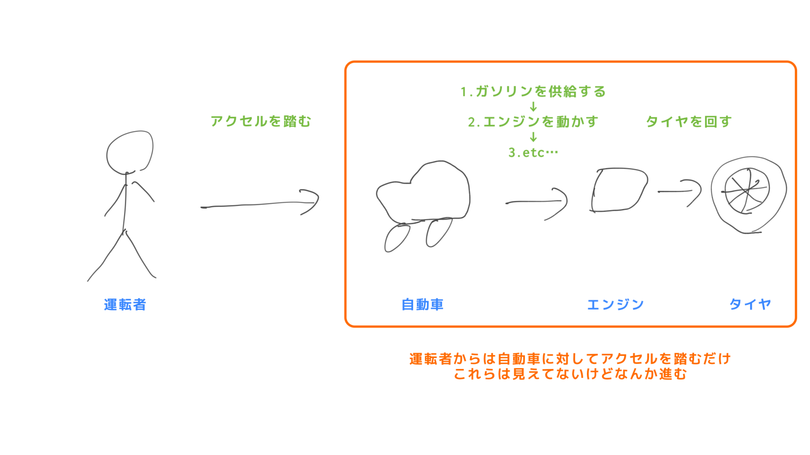
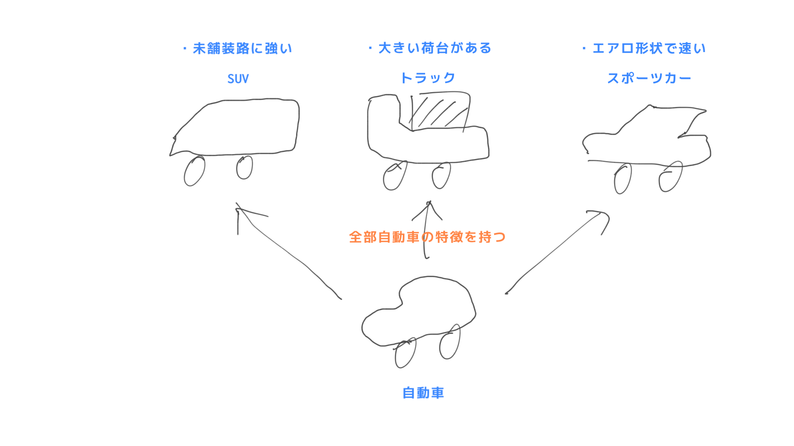
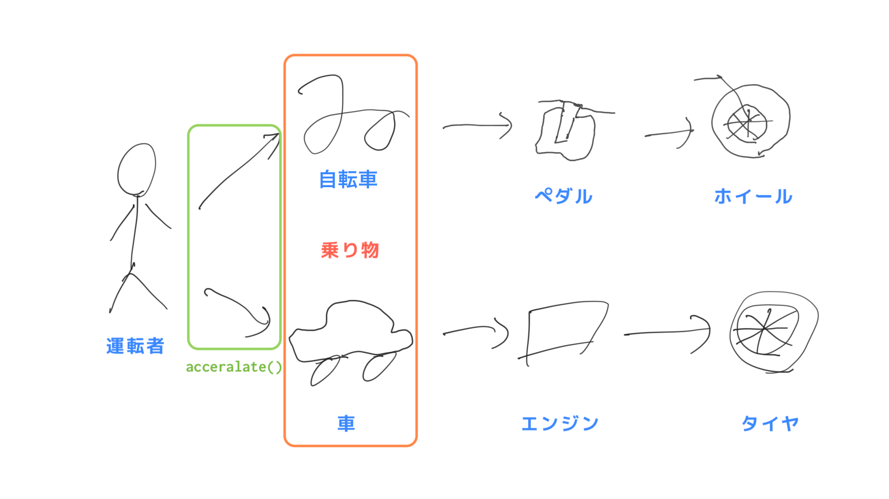
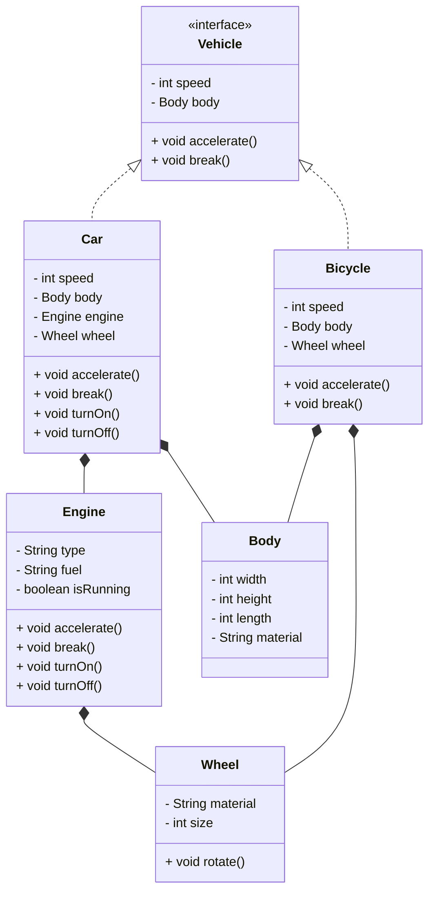

# オブジェクト指向プログラミング

オブジェクト指向について今は理解できなくても大丈夫です。これから様々な説明を見たりコードを書いていく中で納得するタイミングが来ますので、そのときにリフレインしてみてください。

## オブジェクト指向プログラミング (Object-Oriented Programming, OOP) とは

プログラミングにおける一種のパラダイムであり、複雑なソフトウェアをより簡単かつ効率的に開発することを目的としています。

オブジェクト指向プログラミング (以下、OOP) では、プログラムがオブジェクトと呼ばれる独立した部品から構成されると考えます。これらのオブジェクトは、データ（プロパティ）や関数（メソッド）をまとめたものであり、互いに連携して動作することでプログラム全体が機能します。

!!! Note
    **プログラミングパラダイム**とは、プログラムを記述する際の基本的なアプローチやスタイルのことを指します。各々異なる特徴や利点があり、開発者が問題を解決するために適切なツールとして選択することが重要です。オブジェクト指向の他にいくつかの例を挙げます。

	- `手続き型プログラミング`
		- プログラムの状態を変更する手続きや関数のシーケンスで構成されます。主にC言語などで使われています。
	- `関数型プログラミング`
		- 関数に組み合わせによってプログラムを構成するプログラミングパラダイムです。主に Scala などで使われています。
	- `リアクティブ・プログラミング
		- イベントストリームを使用して、非同期的なデータフローに焦点を当てたプログラミングパラダイムです。

OOP の特徴として、`カプセル化`・`継承`・`ポリモーフィズム`があります。

---

### カプセル化

**オブジェクトの内部状態を隠蔽し外部からのアクセスを制限することで、安全に保護すること**です。具体的には、オブジェクトのフィールドに対して直接アクセスできないようにし、代わりにメソッドを通じてフィールドの値を取得・設定することが一般的です。

カプセル化によるメリットは、以下のようになります。

1.  内部状態を保護することができるため、外部からの不正なアクセスによる**データの破壊や不整合を防ぐことができます**。
2.  外部からアクセスできるメソッドを制限することで、オブジェクトの使用方法を明確に定義することができます。これによりオブジェクトの使用者が**不正な操作を行うことを防ぎ、コードの信頼性を高めることができます**。
3.  内部実装を変更することができるため、オブジェクトの利用者に影響を与えることなく、オブジェクトの実装を改良することができます。つまり、オブジェクトの実装の詳細を隠蔽することにより、**プログラム全体を柔軟に変更できるようになります**。

カプセル化は OOP において重要な概念であり特徴的なメリットの一つと言えます。

### 継承

**既存のオブジェクトから新しいオブジェクトを作成することで、コードの再利用性を高めること**です。

継承の元となるクラスのことを`親クラス`、継承先のことを`小クラス`と呼び、親クラスで定義されたメソッドや変数などの機能を子クラスでも利用することができます。子クラスは親クラスのメンバ変数やメソッドをそのまま使ったりカスタマイズしたり、新しい機能を追加したりすることができます。

**継承によりコードの再利用性や保守性が向上し、コードの冗長性を減らすことができます**。また継承の階層を深くすることで、より複雑なオブジェクトを表現することもできます。これは実際にコードを見てみないことにはメリットの理解が少し難しいかもしれません。

### ポリモーフィズム

**同じインターフェースを持つオブジェクトがそれぞれ異なる実装を持つことができる性質のこと**を指します。

具体的には、同じ親クラスを継承した子クラスのインスタンスが、同じメソッド名を持ちながらそれぞれ異なる実装を持つこと（`オーバーライド`）や同一クラス内で引数の違いによってメソッドを呼び分けること（`オーバーロード`）ができます。これによりメソッドを状況によって使い分けることができ、コードの柔軟性や拡張性、保守性も向上します。

---

### 例

例えば、自動車のプログラムを考えてみましょう。自動車は、車体やエンジン、タイヤなどの部品から構成されています。OOP の観点からは、それぞれの部品がオブジェクトとして表現され、自動車オブジェクトはこれらの部品オブジェクトを持っていると考えます。そして、自動車オブジェクトは、エンジンを動かす関数やアクセルを踏む（加速する）関数、ブレーキをかける（減速する）関数などのメソッドを持っており、これらのメソッドを呼び出すことで自動車が動作するようになっています。

実際に運転するとき速度は運転者が直接設定することはできず、自動車はアクセルを踏むことで加速し前に進みます。このアクセルを踏んだとき、自動車の内部ではガソリンを供給してエンジンを動かしてタイヤを回した結果速度が上昇するといった一連のフローを慎重に制御する必要があり、順番を無視して動かしてしまうと壊れてしまうかもしれません。ですが実際には運転者は自動車がどうやって車を動かしているかは知る必要がなく、ただアクセルを踏むだけで加速させる（前に進ませる）ことができます。また、もしエンジンを交換して内部のフローが変わったとしても、運転者はアクセルを踏めば加速することさえわかっていれば問題ありません。これがカプセル化です。

さらに自動車には SUV やトラック、スポーツカーなど異なる種類のものがあります。これらはそれぞれに独自の特徴や機能がありますが、自動車という共通の機能を持っています。そのため１から自動車の設計を考える必要はなく、自動車と言う既に存在する機能を元に設計することができます。これは自動車というオブジェクトを継承してそれぞれのオブジェクトを作っていることになります。

また自動車は乗り物であり、乗り物は車体があり加速・減速するメソッドを共通して持っています。しかし、同じ乗り物でも自転車はペダルを漕ぐことで動きますが自動車はエンジンを使って動くため、同じ `加速` メソッドでも内部の処理は異なります。これがポリモーフィズムです。

クラス図にするとこうなります。

OOP を使うことでより大規模かつ複雑なプログラムを効率的に開発することができます。初心者でもオブジェクト指向プログラミングを学ぶことでより柔軟なコードを書くことができ、バグを減らすことができるなど、プログラミングスキルの向上につながるでしょう。

上記の説明だけを見てきっちり理解するのは無理だと思います。**概念の説明やパターンも複数見る**うちに共通点・相違点から輪郭が見えてくるはずです。

### 参考

- [プログラミング・パラダイム - Wikipedia](https://ja.wikipedia.org/wiki/%E3%83%97%E3%83%AD%E3%82%B0%E3%83%A9%E3%83%9F%E3%83%B3%E3%82%B0%E3%83%91%E3%83%A9%E3%83%80%E3%82%A4%E3%83%A0)
- [オブジェクト指向 - Wikipedia](https://ja.wikipedia.org/wiki/%E3%82%AA%E3%83%96%E3%82%B8%E3%82%A7%E3%82%AF%E3%83%88%E6%8C%87%E5%90%91)
- [オブジェクト指向の基礎 - YouTube](https://www.youtube.com/watch?v=nPAoPVwrD7s&list=PL0BiAlg8j4ZuDSu9GLU73-CVFgenU8T2P)
- [新人プログラマに知っておいてもらいたい人類がオブジェクト指向を手に入れるまでの軌跡 - Qiita](https://qiita.com/hirokidaichi/items/591ad96ab12938878fe1)
- [[初心者]オブジェクト指向でなぜつくるのか - Qiita](https://qiita.com/IZUMIRU/items/959b43dc9eb4f5cdc202)
- [オブジェクト指向が5000%理解できる記事 - Qiita](https://qiita.com/tip1t/items/b2f8e39d7cc23ad505f9)
